# 🧳 Travel Companion Finder

*Travel Companion Finder* is a web-based application that allows users to discover and connect with potential travel companions based on location, travel date, and preferences. It features profile creation, travel detail sharing, friend request handling, and more.

## 🚀 Features

- 🔐 User Registration and Login
- 👥 Find and connect with travel buddies
- 📝 View and update travel profiles
- 📬 Send and receive friend requests
- 🔔 Notifications with pop-ups and request tracking
- 📅 Share upcoming travel plans (destination + date)
- 🧾 Rental services finder based on user-entered location
- 🎥 Video background homepage
- 📍 Google Maps integration
- 📸 Profile picture upload support

## 🛠 Tech Stack

*Frontend:*
- HTML5, CSS3, JavaScript
- React

*Backend:*
- Node.js
- MySQL Database

*Output Screenshots:*

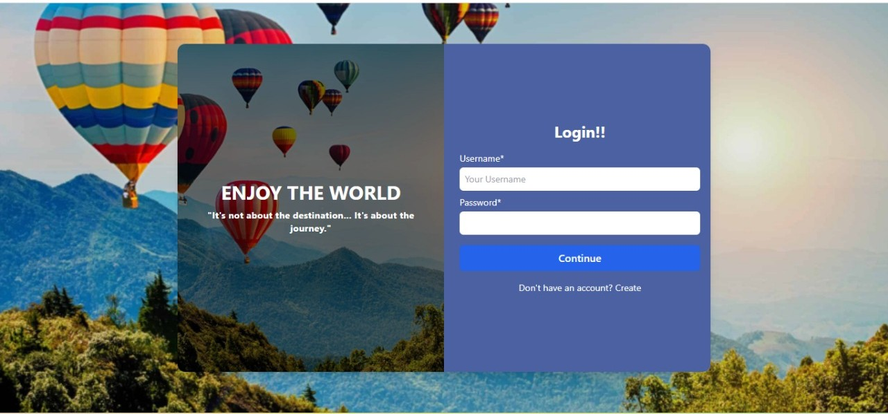

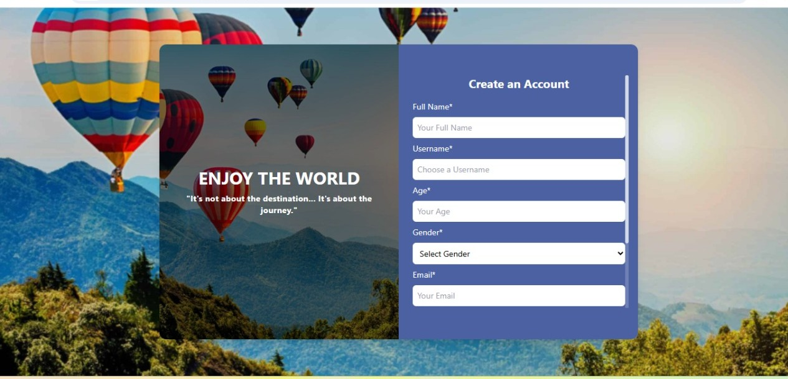

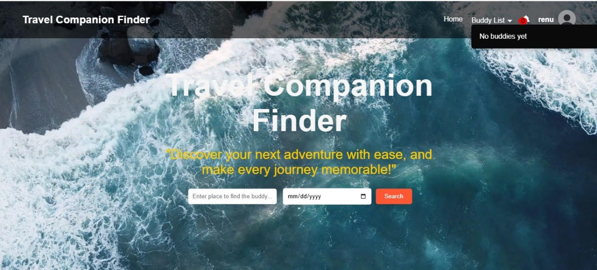

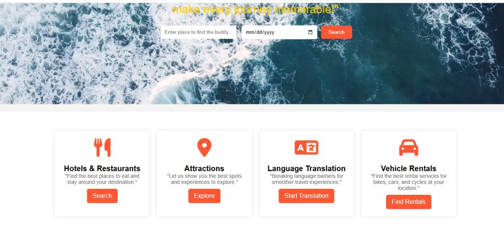

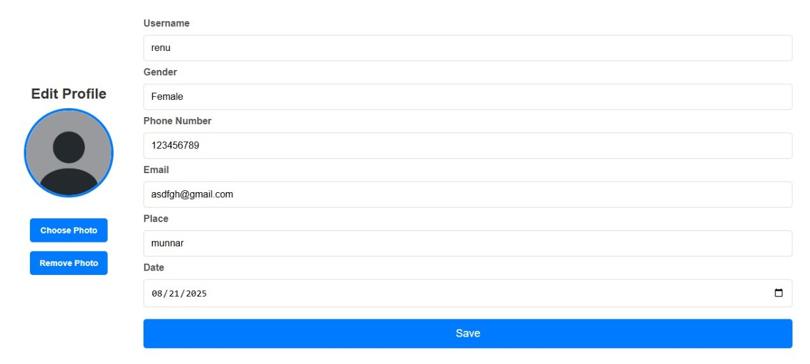

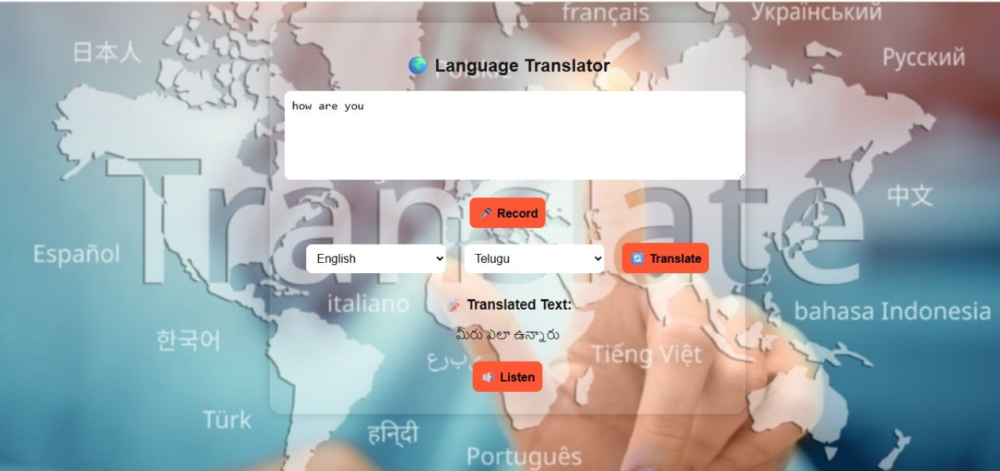

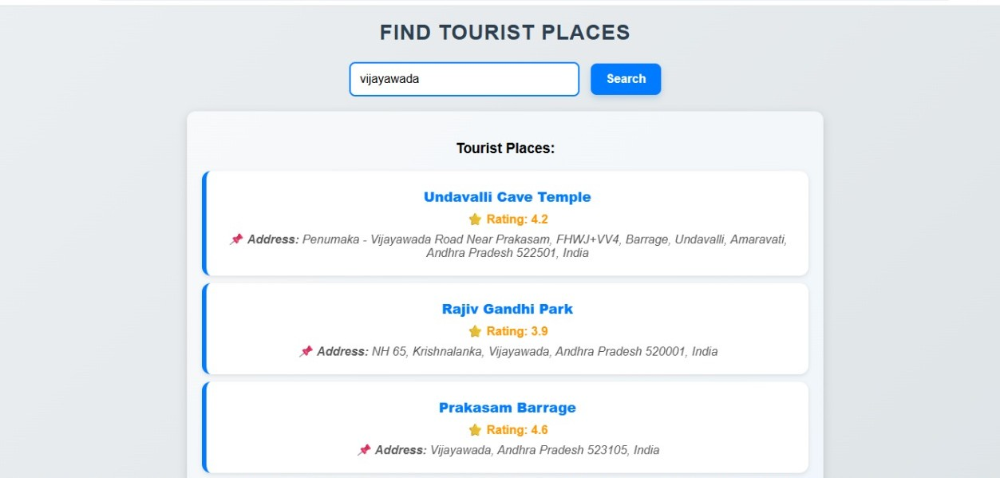

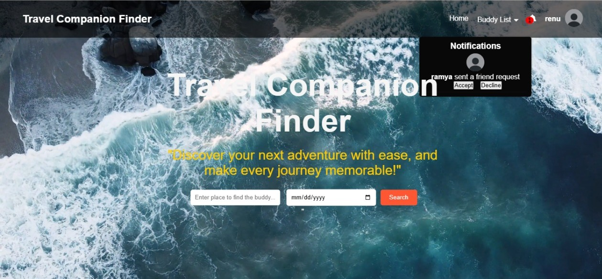

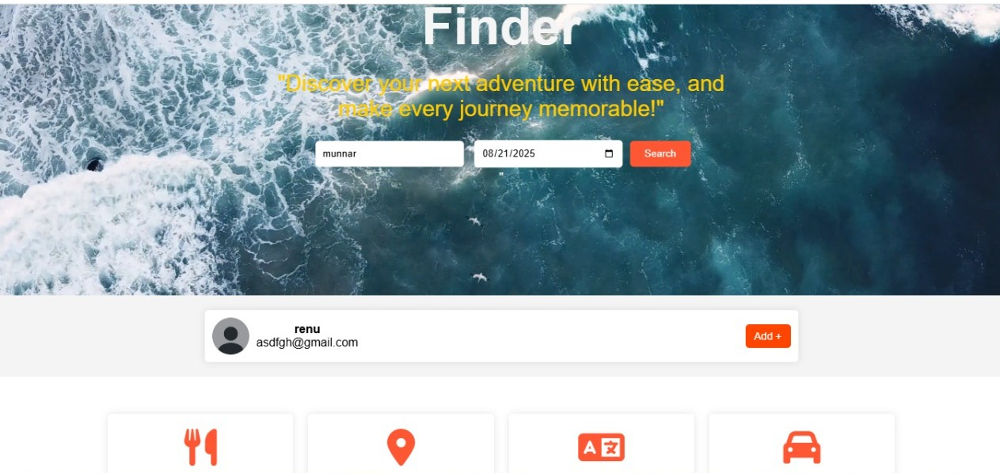

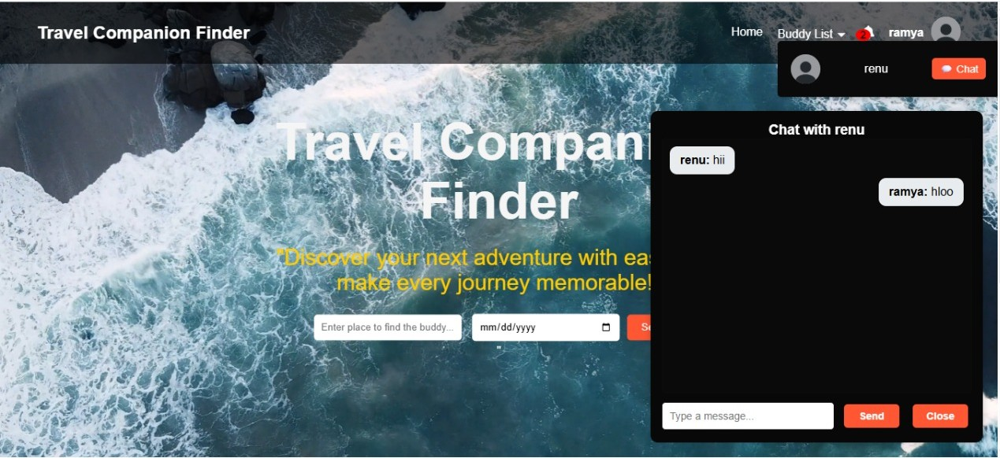

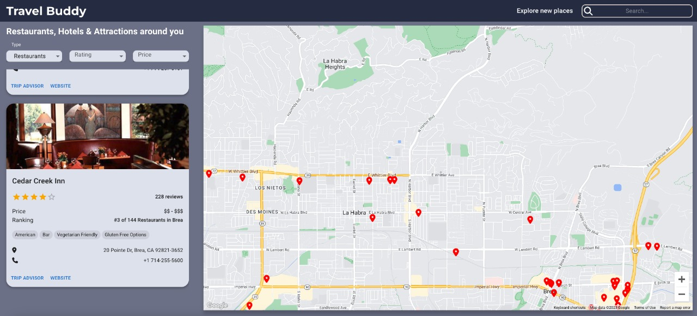
